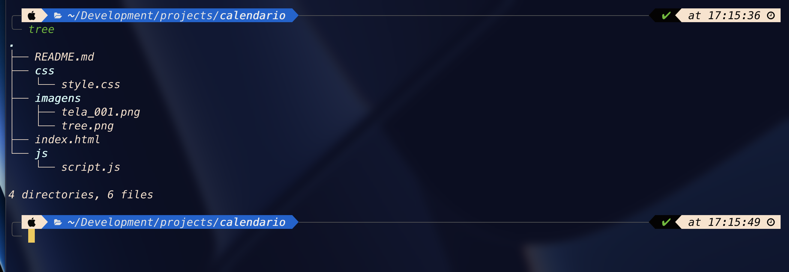
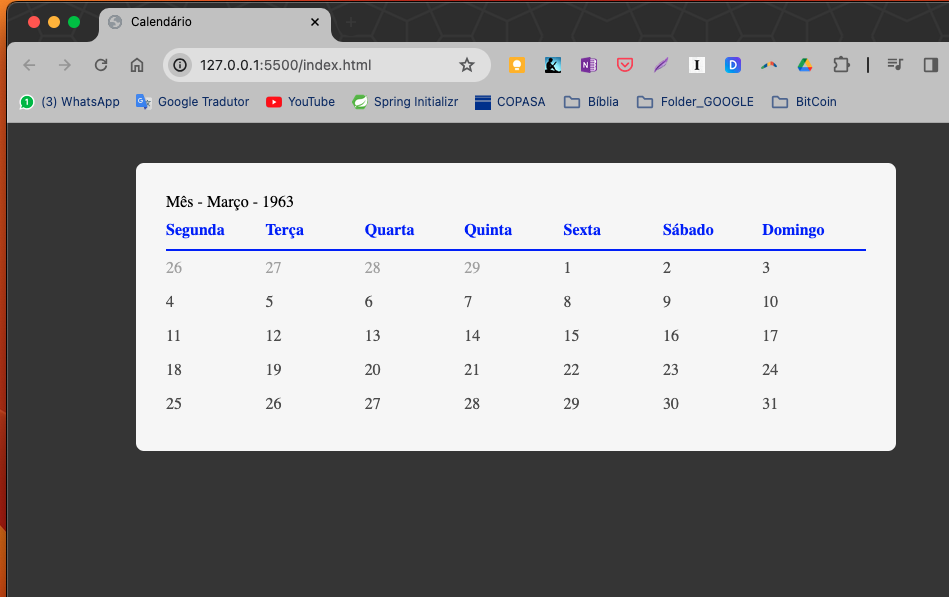

# Nome do Projeto: Calendário

### Status do Projeto: Em Desenvolvimento.

### Descrição:

Projeto de calendário desenvolvido em HTML, CSS e JavaScript com afinalidade de fixar conhecimento.
Usei o mês de Março de 1963 como exemplo no modelo.

### Tecnologias:

-   HTML
-   CSS
-   JAVASCRIPT

#

### tree

### Para usar o projeto é só fazer o clone:

`clone` [Calendário](https://github.com/WMS66/calendario)

#

